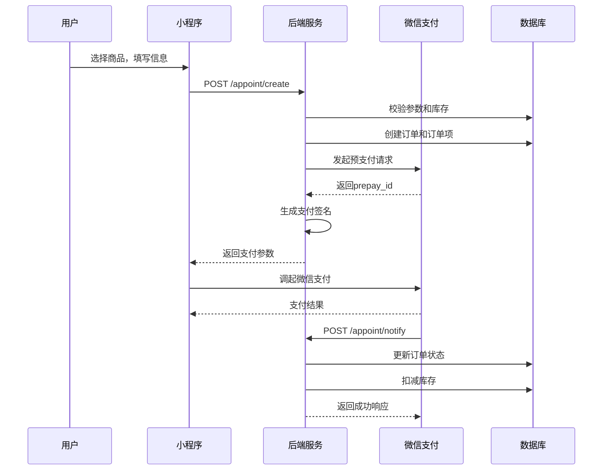
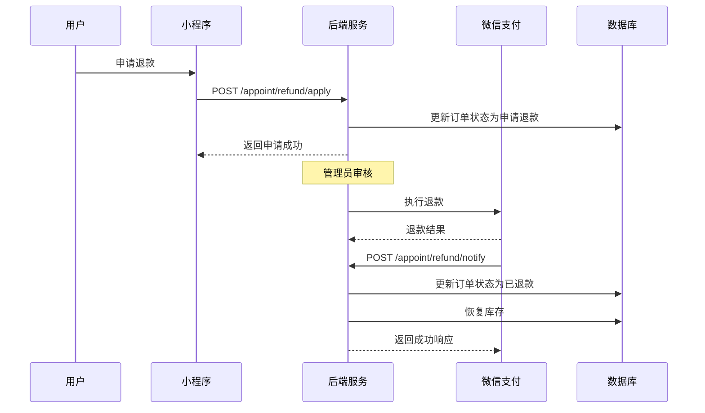

# 微信小程序下单接口文档

## 概述

本文档详细介绍了微信小程序图书商城的下单接口，包括订单创建、支付、查询、退款等功能的API接口说明。

## 接口列表

### 1. 创建订单并发起支付

**接口地址：** `POST /appoint/create`

**功能描述：** 创建订单并发起微信支付，返回小程序支付所需参数

**请求参数：**

```json
{
  "openid": "用户微信openid",
  "name": "收货人姓名",
  "phone": "收货人手机号",
  "address": "收货地址",
  "remark": "订单备注（可选）",
  "bookItems": [
    {
      "bookId": 1,
      "quantity": 2
    },
    {
      "bookId": 3,
      "quantity": 1
    }
  ]
}
```

**参数说明：**

| 参数名 | 类型 | 必填 | 说明 |
|--------|------|------|------|
| openid | String | 是 | 用户微信openid |
| name | String | 是 | 收货人姓名 |
| phone | String | 是 | 收货人手机号（11位数字） |
| address | String | 是 | 收货地址 |
| remark | String | 否 | 订单备注 |
| bookItems | Array | 是 | 商品列表 |
| bookItems[].bookId | Long | 是 | 书籍ID |
| bookItems[].quantity | Integer | 是 | 购买数量（必须大于0） |

**响应示例：**

```json
{
  "code": 200,
  "msg": "操作成功",
  "data": {
    "appId": "wx1234567890abcdef",
    "timeStamp": "1640995200",
    "nonceStr": "abc123def456",
    "package": "prepay_id=wx1234567890abcdef",
    "signType": "RSA",
    "paySign": "签名字符串"
  }
}
```

**错误响应：**

```json
{
  "code": 500,
  "msg": "参数不完整",
  "data": null
}
```

**小程序端调用示例：**

```javascript
// 1. 调用后端接口创建订单
wx.request({
  url: 'https://your-domain.com/appoint/create',
  method: 'POST',
  data: {
    openid: 'user_openid',
    name: '张三',
    phone: '13800138000',
    address: '北京市朝阳区xxx街道',
    remark: '请尽快发货',
    bookItems: [
      { bookId: 1, quantity: 2 },
      { bookId: 3, quantity: 1 }
    ]
  },
  success: function(res) {
    if (res.data.code === 200) {
      // 2. 调起微信支付
      wx.requestPayment({
        appId: res.data.data.appId,
        timeStamp: res.data.data.timeStamp,
        nonceStr: res.data.data.nonceStr,
        package: res.data.data.package,
        signType: res.data.data.signType,
        paySign: res.data.data.paySign,
        success: function() {
          console.log('支付成功');
          // 跳转到订单详情页
        },
        fail: function(err) {
          console.log('支付失败', err);
        }
      });
    } else {
      console.log('创建订单失败', res.data.msg);
    }
  }
});
```

### 2. 微信支付回调

**接口地址：** `POST /appoint/notify`

**功能描述：** 微信支付结果回调接口，系统自动调用

**请求参数：** 微信支付系统自动传递

**响应格式：**

```json
{
  "code": "SUCCESS",
  "message": "成功"
}
```

### 3. 查询订单列表

**接口地址：** `GET /appoint/list`

**功能描述：** 查询订单列表，支持分页和条件筛选

**请求参数：**

| 参数名 | 类型 | 必填 | 说明 |
|--------|------|------|------|
| openid | String | 否 | 用户openid（不传则查询所有订单） |
| address | String | 否 | 收货地址（模糊查询） |
| phone | String | 否 | 手机号（精确查询） |
| name | String | 否 | 收货人姓名（模糊查询） |
| status | String | 否 | 订单状态 |
| page | Integer | 否 | 页码（默认1） |
| size | Integer | 否 | 每页大小（默认10） |

**订单状态说明：**

| 状态值 | 说明 |
|--------|------|
| 待支付 | 订单已创建，等待支付 |
| 0 | 已支付 |
| 1 | 申请退款 |
| 2 | 已退款 |

**响应示例：**

```json
{
  "code": 200,
  "msg": "操作成功",
  "data": {
    "records": [
      {
        "id": 1,
        "outTradeNo": "ORDER123456789",
        "transactionId": "WX123456789",
        "openid": "user_openid",
        "name": "张三",
        "phone": "13800138000",
        "address": "北京市朝阳区xxx街道",
        "remark": "请尽快发货",
        "num": 3,
        "money": 15000,
        "status": "0",
        "payTime": "2024-01-01 12:00:00",
        "createdat": "2024-01-01 11:59:00",
        "orderItems": [
          {
            "id": 1,
            "orderId": 1,
            "bookId": 1,
            "bookName": "Java编程思想",
            "quantity": 2,
            "price": 5000
          },
          {
            "id": 2,
            "orderId": 1,
            "bookId": 3,
            "bookName": "Spring实战",
            "quantity": 1,
            "price": 5000
          }
        ]
      }
    ],
    "total": 1,
    "size": 10,
    "current": 1,
    "pages": 1
  }
}
```

### 4. 申请退款

**接口地址：** `POST /appoint/refund/apply`

**功能描述：** 用户申请退款

**请求参数：**

| 参数名 | 类型 | 必填 | 说明 |
|--------|------|------|------|
| orderId | Long | 是 | 订单ID |
| reason | String | 否 | 退款原因 |

**响应示例：**

```json
{
  "code": 200,
  "msg": "申请退款成功，等待审核",
  "data": null
}
```

### 5. 执行退款（管理员）

**接口地址：** `POST /appoint/refund/execute`

**功能描述：** 管理员执行退款操作

**请求参数：**

| 参数名 | 类型 | 必填 | 说明 |
|--------|------|------|------|
| orderId | Long | 是 | 订单ID |

**响应示例：**

```json
{
  "code": 200,
  "msg": "退款成功",
  "data": null
}
```

### 6. 退款回调

**接口地址：** `POST /appoint/refund/notify`

**功能描述：** 微信退款结果回调接口，系统自动调用

**请求参数：** 微信支付系统自动传递

**响应格式：**

```json
{
  "code": "SUCCESS",
  "message": "成功"
}
```

## 业务流程

### 下单支付流程



### 退款流程



## 错误码说明

| 错误码 | 说明 |
|--------|------|
| 200 | 操作成功 |
| 400 | 参数错误 |
| 500 | 服务器内部错误 |

## 注意事项

1. **安全性**：
   - 所有接口都需要验证用户身份
   - 支付回调需要验证签名
   - 敏感操作需要权限控制

2. **数据一致性**：
   - 订单创建和支付使用事务管理
   - 库存操作需要加锁防止超卖
   - 支付回调需要幂等性处理

3. **异常处理**：
   - 网络异常需要重试机制
   - 支付失败需要回滚订单
   - 库存不足需要提前校验

4. **性能优化**：
   - 订单查询支持分页
   - 数据库查询使用索引
   - 缓存热点数据

## 配置说明

### 微信支付配置

在 `application.yml` 中配置微信支付参数：

```yaml
wxpay:
  appid: 你的小程序appid
  mch-id: 你的商户号
  mch-serial-no: 你的商户证书序列号
  mch-private-key-file-path: 你的私钥文件路径
  api-v3-key: 你的APIv3密钥
  notify-url: 你的支付回调地址
```

### 数据库表结构

#### Order表
```sql
CREATE TABLE `Order` (
  `id` bigint NOT NULL AUTO_INCREMENT,
  `out_trade_no` varchar(64) NOT NULL COMMENT '订单号',
  `transaction_id` varchar(64) DEFAULT NULL COMMENT '交易号',
  `openid` varchar(64) NOT NULL COMMENT '用户openid',
  `name` varchar(50) NOT NULL COMMENT '收货人姓名',
  `phone` varchar(20) NOT NULL COMMENT '联系电话',
  `address` varchar(200) NOT NULL COMMENT '收货地址',
  `remark` varchar(500) DEFAULT NULL COMMENT '订单备注',
  `num` int NOT NULL COMMENT '购买数量',
  `money` int NOT NULL COMMENT '购买金额（分）',
  `status` varchar(20) NOT NULL COMMENT '订单状态',
  `pay_time` datetime DEFAULT NULL COMMENT '支付时间',
  `created_at` datetime NOT NULL COMMENT '创建时间',
  PRIMARY KEY (`id`),
  UNIQUE KEY `uk_out_trade_no` (`out_trade_no`),
  KEY `idx_openid` (`openid`),
  KEY `idx_status` (`status`)
);
```

#### OrderItem表
```sql
CREATE TABLE `order_item` (
  `id` bigint NOT NULL AUTO_INCREMENT,
  `order_id` bigint NOT NULL COMMENT '订单ID',
  `book_id` bigint NOT NULL COMMENT '书籍ID',
  `book_name` varchar(100) NOT NULL COMMENT '书籍名称',
  `quantity` int NOT NULL COMMENT '购买数量',
  `price` int NOT NULL COMMENT '单价（分）',
  PRIMARY KEY (`id`),
  KEY `idx_order_id` (`order_id`),
  KEY `idx_book_id` (`book_id`)
);
```

## 更新日志

- **v1.0.0** (2024-01-01)
  - 初始版本
  - 支持订单创建、支付、查询、退款功能
  - 添加库存管理
  - 完善错误处理和日志记录

---

**作者：** tangxin  
**更新时间：** 2024-01-01  
**版本：** v1.0.0
